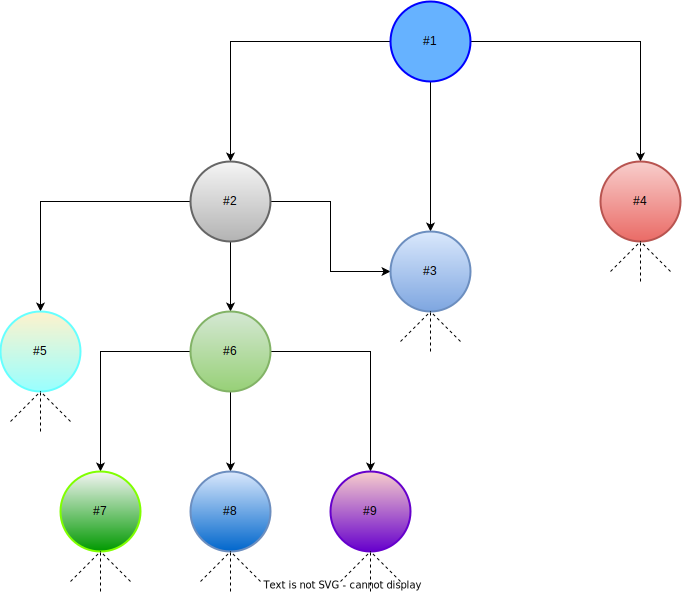

# Graph Funder
- Mission
- How does it work?
- Introducing Graph-Funding Technology
- Automatized Distribution

## Mission
Our mission is to leverage web3 tools to improve the funding of **public goods**. We believe blockchain is the most powerful technology ever created to achieve this goal. **LET'S LEVERAGE IT TO CAUSE A HUGE IMPACT ON OUR COMMUNITY!!!**

## How does it work?
Through the _Graph Funder Platform_ users can tokenize their open source projects in order to receive funding by the very community who benefits from them. We use ERC721 pattern to register the projects as NFTs and anyone can make donations directly to them so the teams can benefit from those donations and continue working on the tools that help advance important causes in the developing ecosystem.

But how does our platform is differ from any other donation based plartform? The answer to this question is what gave birth to its very name...

## Introducing Graph-Funding technology

The main key innovation that our platform brings is the possibility of NFT owners to set how the protocol will distribute the donations received between them and all the other projects used as **dependencies**. That is crucial because every great project is enabled by many the others that came before it. We are all standing in the shoulder of giants after all.

As a result of this dynamic of coded referencing between the registered projects, a big _graph_ emerges, a **Funding Graph**. The money received by a given NFT, directly and indirectly as a dependency, will be split with the works cited by its owner as dependencies. The links between the NFTs will form many paths to the money donated.

The image below shows a simple representation of this dynamic: #1 lists #2, #3 and #4 as dependencies; #2 lists #3, #5 and #6; #6 lists #7, #8 and #9 and so on. The dotted lines below the other NFTs intend to show that they themselves point to other dependencies that can be or not the ones depicted in the image. All the NFTs shown, as well as all the dependencies listed by them (that are not shown in the image) represent the dependency tree of #1. Every cent received by #1 is gonna be split with all the NFTs in its dependency tree. The money trickles down the tree to its very last branch.

The NFTs present in the most amount of trees is likely gonna receive the most amount of funds. This model guarantees that the most impactful works will get rewarded proportinally, as it should be. No voting required! You vote with your dollar and the protocol does the rest.

## Automatized Distribution
The methods tha enable the funds to be transfered to the NFT's owner as well as to the balance of its dependencies are callable by any address. The protocol pays a percentage fee over the value being claimed to the caller to encourage people to provide this service.  We expect that the profit opportunity that emerges from this dynamic will give rise to searchers (which we call _claimers_) who constantly monitor the paltform looking for profit opportunities.

These searchers, or _claimers_, will manifest in the form of bots run by scripts to execute this task. Once enough searchers act in this manner, the distribution of funds by the platform will be automated, making the operation quicker and more efficient.
 [example script]

## Why Celo Network?
The Graph Funder Platform is implemented via smart contract and deployed in [Celo Network](https://celo.org/). Celo is one of the most promising new PoS layer 1 attracting many new interesting projects. The community it is very interested in fommenting new practical solutions to **public goods funding**. We very much share their vision about the future of the ecosystem being moved in this direction.

## Tech Stack
- Celo
- Hardhat
- Next.js
- Wagmi.sh

